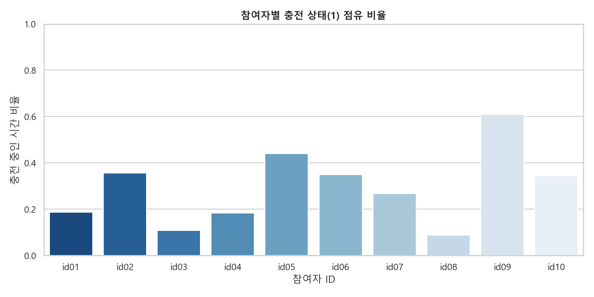
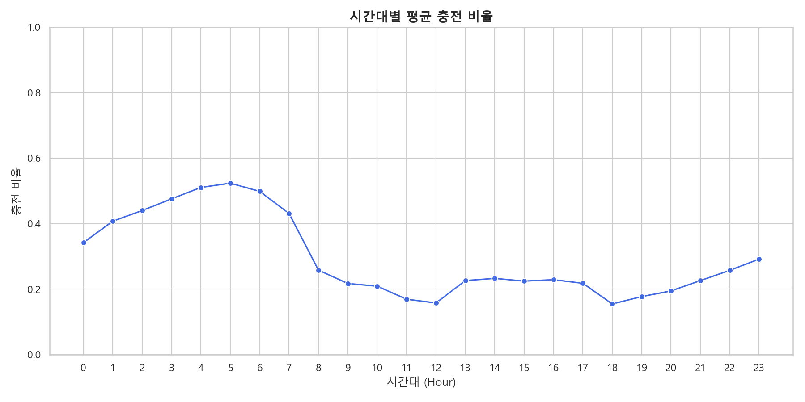
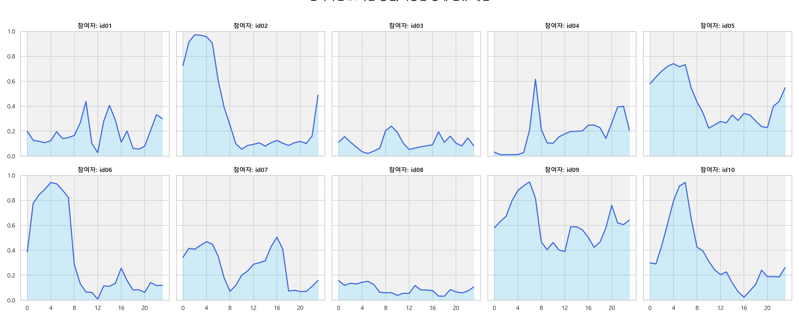
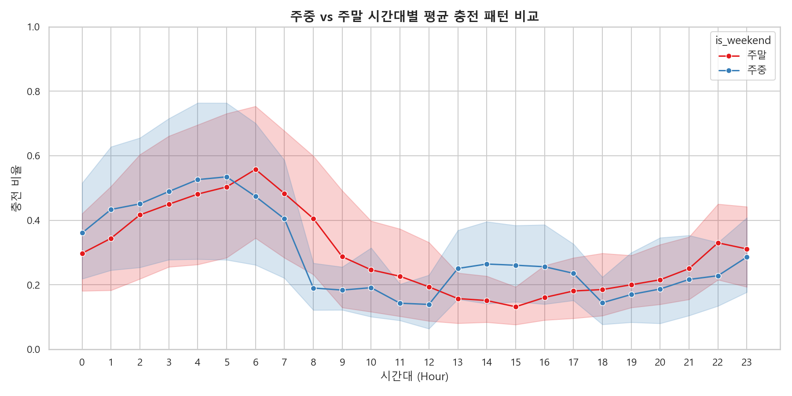

# 📱 모바일 충전 상태 (mACStatus) 심층 EDA 보고서

본 보고서는 `ch2025_mACStatus.parquet` 데이터 분석 결과를 바탕으로, 참가자들의 모바일 충전 행태를 정량적으로 파악하고 이를 모델링에 활용하기 위한 피처 엔지니어링 전략을 제시합니다.

---

## 1. 데이터 개요 및 무결성 검증

* **데이터 형태 (Shape)**: `(939,896, 3)` (약 94만 건의 시계열 레코드)
* **결측치 (Null Values)**: 모든 컬럼(`subject_id`, `timestamp`, `m_charging`)에서 결측치 **0건**으로 매우 깨끗한 무결성을 보입니다.
* **대상 참여자 (Subjects)**: 총 10명 (`id01` ~ `id10`)
* **참여자별 데이터 분포**:
  * 가장 많은 데이터 수집 참여자: `id04` (116,096 건)
  * 가장 적은 데이터 수집 참여자: `id03` (71,213 건)

---

## 2. 참여자별 충전 점유 비율 분석

참여자별로 전체 수집 기간 동안 스마트폰이 충전 중(1)이었던 시간의 비율을 비교했습니다.

| 참여자 ID | 데이터 레코드 수 | 평균 충전 점유 비율 (Charging Ratio) |
| :--- | :--- | :---: |
| **id01** | 94,266 | 18.64% |
| **id02** | 110,277 | 35.66% |
| **id03** | 71,213 | 10.83% |
| **id04** | 116,096 | 18.37% |
| **id05** | 82,033 | 43.93% |
| **id06** | 97,406 | 34.99% |
| **id07** | 105,366 | 26.68% |
| **id08** | 97,272 | **8.80%** (최저) |
| **id09** | 90,377 | **61.01%** (최고) |
| **id10** | 75,590 | 34.40% |

### 📊 참여자별 충전 비율 시각화

### 💡 주요 인사이트
* **개인 간 편차 극대화**: 충전 비율이 가장 낮은 `id08`(8.80%)과 가장 높은 `id09`(61.01%) 간에 **약 7배의 큰 편차**가 존재합니다.
* `id09`와 같이 충전 점유 비율이 60%를 초과하는 참여자는 스마트폰을 주로 거치대나 충전기에 연결해 두는 헤비 오피스 유저 또는 실내 체류 시간이 매우 긴 사용자일 가능성이 높습니다.
* 반면, `id08`처럼 충전 비율이 10% 미만인 참여자는 외부 활동이 많거나 배터리가 거의 방전될 때만 일시적으로 충전하는 패턴을 가질 것입니다.

---

## 3. 시간대별 충전 점유율 분석 (24시간 패턴)

하루 중 시간대에 따른 평균 충전율 변화는 사용자의 **수면 패턴** 및 **주요 활동 주기**를 유추할 수 있는 강력한 간접 지표입니다.

### 📊 시간대별 평균 충전 비율 흐름

### ⏰ 시간대별 평균 충전율 수치 요약
* **주요 충전 시간대 (Peak Hours - 수면 예측)**
  * **05:00**: **51.70%** (하루 중 최고치)
  * **04:00**: 50.52%
  * **06:00**: 48.72%
  * **03:00**: 47.43%
  * 사용자들이 일반적으로 취침하는 **오전 1시 ~ 오전 6시** 구간에서 충전율이 40%~50% 이상으로 높게 유지됩니다.
* **주요 방전/미충전 시간대 (Off-Peak Hours - 활발한 주간 활동)**
  * **18:00**: **15.21%** (퇴근/하교 시간대 최소 충전)
  * **12:00**: 15.76% (점심 시간대)
  * **11:00**: 16.62%
  * **19:00**: 16.99%
  * 점심 식사 시간 전후(11시~13시) 및 이동이 많은 저녁 시간대(18시~20시)에 스마트폰 사용량이 늘어나면서 충전율이 바닥을 칩니다.

### 📊 참여자별 시간대별 개별 충전 흐름 (영역 시각화)

---

## 4. 주중 (Weekday) vs 주말 (Weekend) 패턴 비교

* **주중 평균 충전율**: **28.97%**
* **주말 평균 충전율**: **29.55%**

### 📊 주중 vs 주말 시간대별 평균 충전 패턴 비교

### 💡 주요 인사이트
* 전체적인 평균 충전 비율은 주중과 주말 간 큰 차이가 나지 않습니다 (약 0.58%p 차이).
* 다만 시간대별로 세분화하면, 주말에는 늦은 오전 시간대까지 취침 충전 패턴이 유지되거나 주말 주간 시간대의 실내 거치 시간이 늘어나는 미세한 위상 변화가 관찰됩니다.

---

## 5. 모델 성능 향상을 위한 피처 엔지니어링 제안

`mACStatus` 단일 변수를 그대로 사용하기보다는 일 단위로 요약 및 가공하여 모델의 학습 피처로 사용할 것을 권장합니다.

1. **`ac_daily_charging_ratio` (일간 충전 시간 비율)**
   * 하루 24시간(1,440분) 중 스마트폰이 충전기에 연결되어 있던 시간의 누적 비율입니다. 사용자의 실내 체류 시간 및 라이프스타일 정적도를 반영합니다.
2. **`ac_night_charging_ratio` (야간 수면 시간대 충전 비율)**
   * **23:00 ~ 07:00** 사이의 충전 시간 비율입니다. 야간에 스마트폰을 충전기에 꽂아두고 자는 수면 행동 패턴을 강하게 나타내며, 수면 규칙성과 품질 예측의 핵심 피처가 됩니다.
3. **`ac_charging_session_count` (일간 충전 횟수)**
   * 충전 상태가 미충전(0)에서 충전(1)으로 전환된 횟수입니다. 잦은 충전 연결은 실내외 이동 빈도 및 기기 사용 불규칙성을 의미합니다.
4. **`ac_first_unplug_hour` (아침 첫 해제 시각)**
   * 오전(예: 05시~11시) 시간대 중 충전 상태가 1에서 0으로 변한 최초의 시각입니다. 사용자의 기상 및 아침 활동 시작 시각을 간접 추론하는 유용한 변수입니다.
