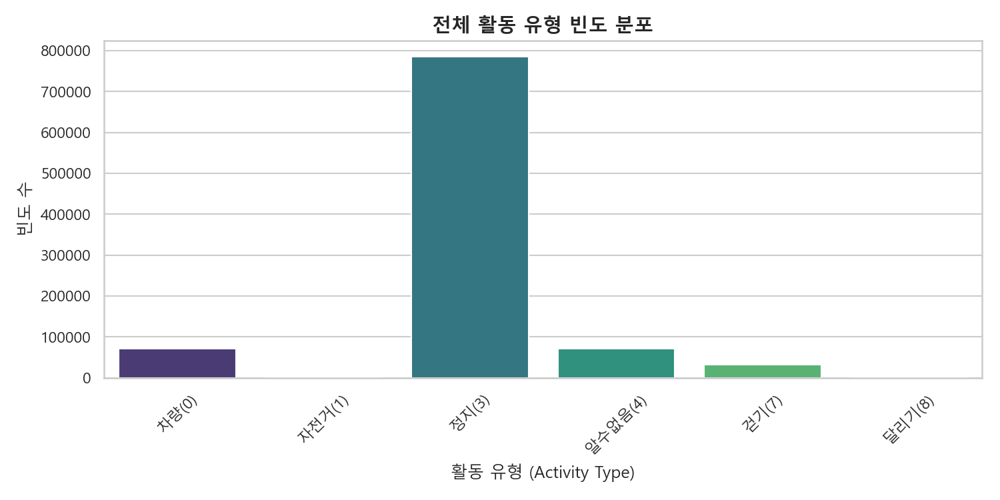
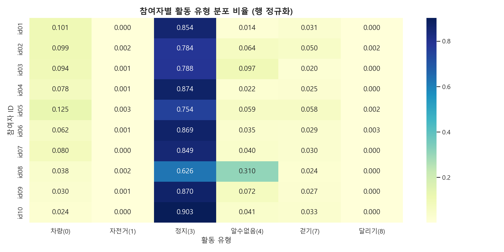
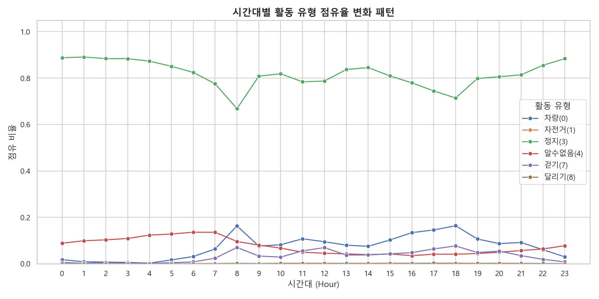

# 🏃 모바일 신체 활동 상태 (mActivity) 심층 EDA 보고서

본 보고서는 `ch2025_mActivity.parquet` 데이터 분석 결과를 바탕으로, 참가자들의 신체 활동 행태를 정량적으로 분석하고 이를 예측 모델에 적용하기 위한 피처 엔지니어링 전략을 설계합니다.

---

## 1. 데이터 개요 및 무결성 검증

* **데이터 형태 (Shape)**: `(961,062, 3)` (약 96만 건의 시계열 레코드)
* **결측치 (Null Values)**: 모든 컬럼(`subject_id`, `timestamp`, `m_activity`)에서 결측치 **0건**으로 완벽한 데이터 무결성을 보입니다.
* **대상 참여자 (Subjects)**: 총 10명 (`id01` ~ `id10`)

---

## 2. 전체 활동 유형 빈도 분포

전체 수집 데이터 내에 나타나는 행동 코드들의 빈도 분포를 파악하여 기초 통계를 요약했습니다.

| 활동 코드 | 활동 유형 이름 | 데이터 빈도 수 (Counts) | 점유 비율 (Ratio) |
| :---: | :--- | :---: | :---: |
| **0** | 차량 (VEHICLE) | 70,506 | 7.34% |
| **1** | 자전거 (BICYCLE) | 1,056 | 0.11% |
| **2** | 보행(foot) (FOOT) | 0 | 0.00% |
| **3** | 정지 (STILL) | 785,792 | **81.76%** (지배적) |
| **4** | 알수없음 (UNKNOWN) | 71,502 | 7.44% |
| **5** | 기울기 (TILTING) | 0 | 0.00% |
| **7** | 걷기 (WALKING) | 31,404 | 3.27% |
| **8** | 달리기 (RUNNING) | 802 | 0.08% |

### 📊 전체 활동 유형 빈도 분포 시각화

### 💡 주요 인사이트
* **지배적인 정지 상태(STILL)**: 전체 시계열 로그 중 약 **81.76%**가 스마트폰이 정지 상태(3)에 머물렀던 구간입니다. 스마트폰 센서 수집의 특성상 일상 시간의 대부분은 거치나 착용 상태에서 움직임이 없음을 뜻합니다.
* **실제 데이터 부재 영역 검증**: ETRI 공식 데이터 스키마 가이드에는 명시되어 있으나, 본 분석 대상 파일인 `ch2025_mActivity.parquet`에는 **`2` (보행(foot))번 및 `5` (기울기)번 코드에 해당하는 데이터가 한 건도 존재하지 않습니다.** 모델 개발 시 이 두 범주는 학습 대상에서 제외해도 무방합니다.
* **동적 활동의 극소성**: 걷기(3.27%), 자전거(0.11%), 달리기(0.08%) 등 격렬하거나 칼로리 소비량이 높은 동적 활동은 극히 낮은 비중을 차지합니다.

---

## 3. 참여자별 활동 유형 분포 비교

각 참여자별로 하루 동안 나타나는 활동의 평균 점유 비율을 크로스탭(Heatmap) 형태로 비교했습니다.

### 📊 참여자별 활동 유형 분포 비율 (행 정규화)

### 💡 주요 인사이트
* **기기 센서 오류/데이터 불완전성 식별 (`id08`)**:
  * `id08` 참여자는 전체 데이터의 **31.03%**가 **`4` (알수없음)**으로 잡혀 있습니다. 다른 참여자들의 평균 알수없음 비율(약 1%~9%)에 비해 기기의 센서 감지 오류나 유실이 빈번했음을 나타냅니다.
  * `id08` 모델링 시 이 불완전성을 보정할 수 있는 견고성 장치가 필수적입니다.
* **정적 라이프스타일 (`id10`):**
  * `id10` 참여자는 **정지(3) 비율이 90.28%**로 가장 높으며, 상대적으로 동적 활동량이 현저하게 낮습니다.
* **고이동성 라이프스타일 (`id05`):**
  * `id05` 참여자는 **차량(0) 비율이 12.47%**, **걷기(7) 비율이 5.80%**로 전 참여자 중 물리적 이동 반경 및 적극적 이동 비율이 가장 높게 집계되었습니다.

---

## 4. 시간대별 활동 유형 점유율 변화 패턴

하루 24시간 동안 각 활동 유형이 차지하는 비중의 평균 흐름을 시각화하였습니다.

### 📊 시간대별 활동 유형 점유율 변화 패턴

### ⏰ 시간대별 주요 변화 특징
* **정지(STILL) 상태의 주기성**:
  * 취침 시간대인 **23:00 ~ 07:00** 사이에는 정지(3) 상태의 점유 비율이 **87% ~ 89%** 이상으로 최고조에 달합니다.
  * 활동이 활발한 낮 시간대(13:00 ~ 17:00)에는 정지 비율이 **72% ~ 75%** 수준으로 감소하며, 차량 탑승 및 보행 활동 비율이 상대적으로 증가합니다.
* **차량(VEHICLE) 탑승 시간대의 피크**:
  * 전형적인 출퇴근 시간대인 **오전 08:00 (10.0%)** 및 **오후 18:00 (10.9%)** 전후에 차량(0) 탑승 비율이 명확하게 솟구칩니다.

---

## 5. 모델 성능 향상을 위한 피처 엔지니어링 제안

1. **`act_daily_entropy` (활동 다양성 엔트로피)**
   * 하루 동안 나타난 행동 유형 분포의 Shannon Entropy를 구합니다. 일상 패턴이 단순한지(낮은 엔트로피), 혹은 차량-도보-정지가 섞여 활동적인지(높은 엔트로피) 수치화합니다.
2. **`act_dynamic_ratio` (동적 활동 비율)**
   * 걷기(7), 자전거(1), 달리기(8) 등 신체 움직임이 동반된 비율을 합산하여 사용자의 하루 활동 지수를 생성합니다.
3. **`act_commute_indicator` (출퇴근 차량 이용 여부)**
   * 08~09시 혹은 17~19시 시간대에 차량(0) 상태가 일정 임계 시간 이상 탐지될 때 출퇴근을 차량으로 수행한 지표를 생성합니다.
4. **`act_unknown_ratio` (데이터 품질 지표)**
   * 하루 수집 데이터 중 알수없음(4)의 비율을 피처로 명시하여 센서 에러에 의한 이상치 왜곡을 모델 스스로 인지하게 합니다.
