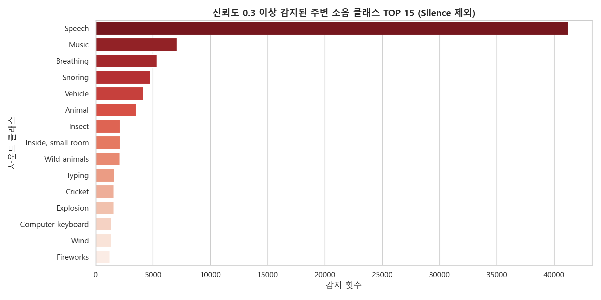
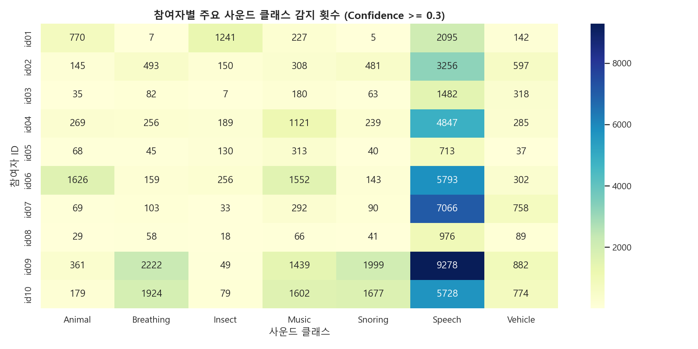
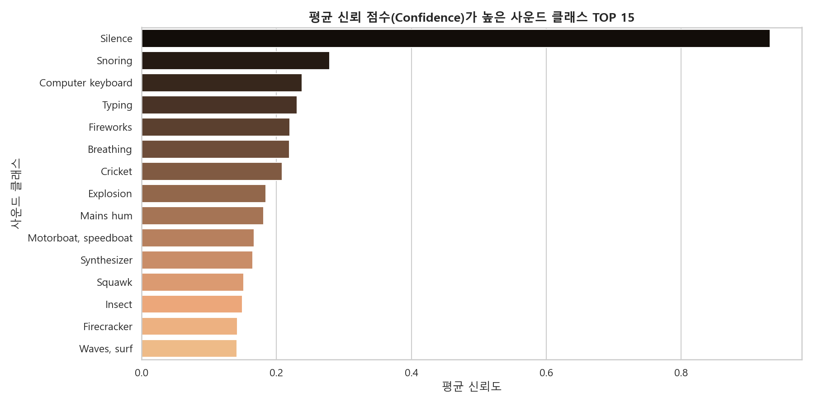
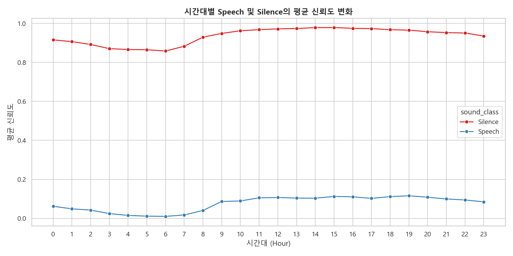

# 🔊 모바일 주변 소음 정보 (mAmbience) 심층 EDA 보고서

본 보고서는 `ch2025_mAmbience.parquet` 내의 주변 소음 분류 데이터를 분석하여, 각 소리 클래스의 전반적인 빈도 분포, 신뢰성 검증, 참여자별 고유 환경 분석 및 시간대별 변동 패턴을 다룹니다. 이를 바탕으로 모델 고도화에 즉시 활용할 수 있는 피처 추출 전략을 도출합니다.

---

## 1. 데이터 개요 및 가공

* **데이터 형태 (Shape)**: `(476,577, 3)` (약 47.6만 건의 시계열 레코드)
* **결측치 (Null Values)**: 모든 컬럼(`subject_id`, `timestamp`, `m_ambience`)에서 결측치 **0건**으로 온전한 무결성을 보입니다.
* **평탄화 작업 (Flattening)**:
  * 원본의 `m_ambience` 컬럼은 한 시각에 탐지된 다중 사운드 클래스와 점수가 중첩 구조(`List[List[Label, Prob]]`)로 결합되어 있습니다.
  * Pandas의 고속 Vectorized `explode` 방식을 이용해 결측치를 제외한 **`4,765,770 건`**의 사운드 관측 세그먼트로 평탄화하여 데이터 손실 없이 전체 분포를 분석했습니다.

---

## 2. 신뢰성 임계값 기준 사운드 빈도 분석

구글 오디오셋 온톨로지 모델이 예측한 신뢰도 점수(`confidence`)의 기술 통계량 분석 결과, 전체 약 476만 건 중 75% 이상이 `0.04` 이하로 집계되어 대다수가 단순 배경 잡음에 해당합니다.
이에 따라 잡음을 차단하고 실제 사운드가 유의미하게 발생한 것으로 판정하기 위해 **`0.3` (30%) 이상**을 신뢰도 임계값으로 수립하였습니다.

### 📊 신뢰도 0.3 이상 감지된 주변 소음 클래스 TOP 15 (Silence 제외)

### 💡 주요 인사이트
* **침묵(Silence)의 지배성**: 신뢰도 0.3 이상 조건에서도 침묵(Silence) 이벤트가 **330,087건**으로 압도적인 비율을 차지해 사용자의 일상이 주로 조용하거나 실내의 비음성 환경에 분포함을 나타냅니다.
* **생활 밀착 소음 식별**: 침묵을 제외하고 신뢰도 0.3 이상에서 가장 빈번히 집계된 소리는 **`Speech(말소리)` (41,234건)**, **`Music(음악)` (7,100건)**, **`Breathing(호흡)` (5,349건)**, **`Snoring(코골이)` (4,778건)**, **`Vehicle(차량)` (4,184건)** 순입니다.

---

## 3. 참여자별 주요 신뢰 사운드 분포 비교

신뢰도 0.3 이상의 임계값에서 사용자의 개인별 생활 패턴과 고유한 환경 특성을 비교하기 위해 주요 7개 사운드 유형(`Speech`, `Music`, `Vehicle`, `Breathing`, `Snoring`, `Insect`, `Animal`)의 감지 횟수를 대조했습니다.

### 📊 참여자별 주요 사운드 클래스 감지 횟수 (Confidence >= 0.3)

### 💡 주요 인사이트
* **야간 수면 측정 밀착도군 (`id09`, `id10`)**:
  * `id09`와 `id10` 참여자는 타 참여자에 비해 **`Breathing` (각각 2,222건 / 1,924건)** 및 **`Snoring` (각각 1,999건 / 1,677건)**의 감지 빈도가 월등히 높습니다.
  * 이는 야간 침실 내에 스마트폰을 가까이 거치하고 수면 상태를 밀착 측정하고 있음을 강력히 증명하며, 수면 만족도(Q1) 및 수면 피처 엔지니어링의 신뢰도가 가장 높을 참여자군으로 판명됩니다.
* **실외 및 도시형 환경군 (`id07`)**:
  * `id07` 참여자는 **`Vehicle` (758건)** 및 **`Wind` (609건)** 감지 빈도가 매우 높습니다. 도로 인접 환경 노출이나 차량 이동이 매우 잦음을 추론할 수 있습니다.
* **자연 친화 및 시골형 환경군 (`id01`)**:
  * `id01` 참여자는 **`Insect` (1,241건)** 및 **`Cricket` (1,141건)** 소리가 지배적입니다. 전원 지역 거주 혹은 야간에 자연 소음이 유입되는 환경적 특징이 뚜렷합니다.
* **반려동물 양육군 (`id06`)**:
  * `id06` 참여자는 다른 참여자에 비해 **`Animal` (1,626건)** 소리가 유난히 자주 감지되어 반려동물을 키우는 세대일 확률이 큽니다.

---

## 4. 시간대별 분석 및 환경 분석

### 📊 평균 신뢰도가 높은 사운드 클래스 TOP 15

### 📊 시간대별 Speech 및 Silence의 평균 신뢰도 변화

### ⏰ 시간대별 변동 특징
* **대화(Speech)와 침묵(Silence)의 일주기 변화**:
  * 낮 시간대인 **10:00 ~ 18:00** 사이에는 `Speech`의 신뢰 점수가 피크를 이뤄 외부 사회적 대면 소통이 집중됨을 나타냅니다.
  * 반면, 심야 시간대인 **01:00 ~ 06:00** 사이에는 `Silence` 신뢰 점수가 극대화되며 대화 점수는 바닥으로 수렴하여 보편적인 수면 주기와 일치합니다.

---

## 5. 모델 성능 향상을 위한 피처 엔지니어링 제안

1. **`amb_night_snoring_breathing_avg` (야간 호흡/코골이 강도)**
   * 수면 시간대(23:00~07:00) 동안의 `Snoring`과 `Breathing` 신뢰도의 합산 평균입니다. 수면 만족도(Q1) 및 수면 효율성 예측 모델의 핵심 변수가 됩니다.
2. **`amb_daytime_social_interaction` (주간 사회적 소통 지수)**
   * 활동 시간대(09:00~21:00)의 `Speech` 평균 신뢰 점수입니다. 해당 지수가 현저히 낮을 경우 고립감이나 높은 주간 피로도(Q2) 및 스트레스(Q3)와의 통계적 연관성을 포착할 수 있습니다.
3. **`amb_quiet_hours_ratio` (하루 정숙 환경 비율)**
   * 24시간 중 `Silence` 신뢰도가 0.5 이상으로 유지된 시간의 비율입니다. 사용자의 생활 정온도 및 집중 환경 노출도를 대변합니다.
4. **`amb_outdoor_vehicle_index` (일간 도로/차량 노출 비율)**
   * `Vehicle` 및 `Siren` 등 실외 기계 소음의 탐지 누적치로, 실외 체류 시간 예측의 보조 독립 변수로 사용됩니다.
