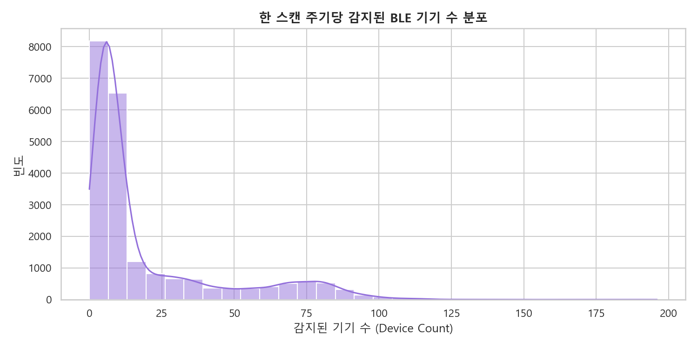
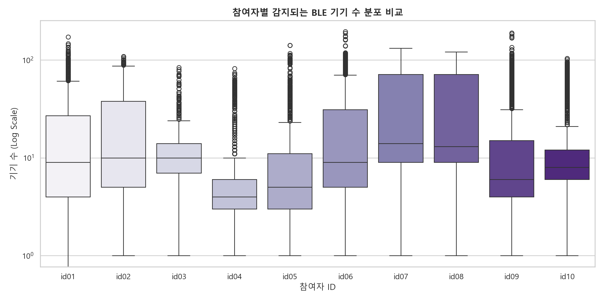
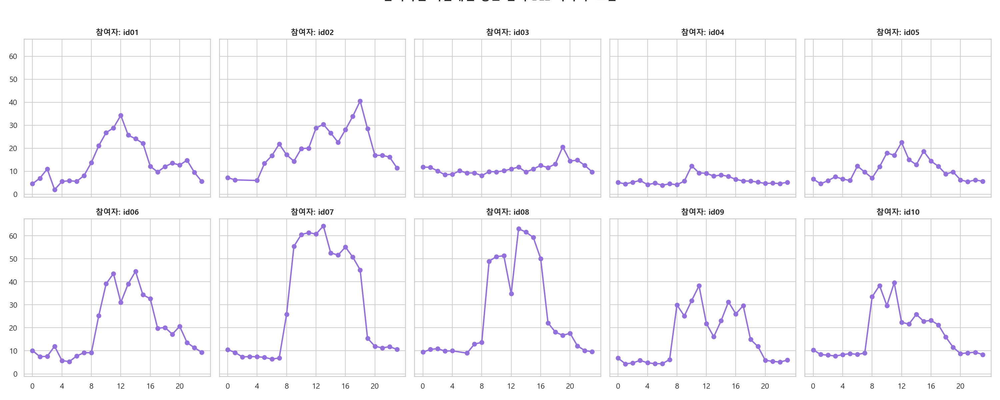
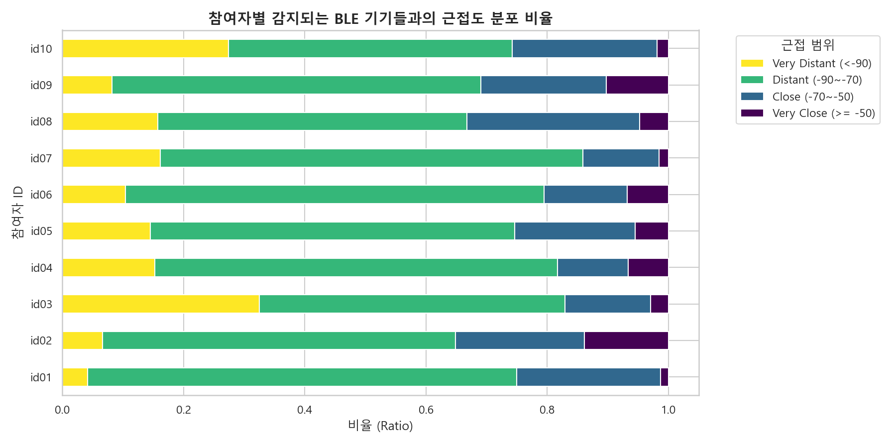
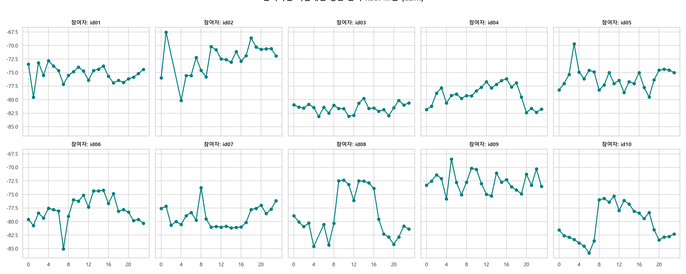

# 📶 모바일 BLE 스캔 정보 (mBle) 심층 EDA 보고서

본 보고서는 `ch2025_mBle.parquet` 주변 저전력 블루투스(BLE) 스캔 데이터를 분석하여, 수집 기기 수 분포, 신호 세기(RSSI) 특성, 참여자별 고유한 물리적 환경 및 시간대별 변동 흐름을 고찰합니다. 이를 바탕으로 모델의 예측력을 높일 수 있는 전처리 및 피처 엔지니어링 전략을 제시합니다.

---

## 1. 데이터 개요 및 무결성 검증

* **데이터 형태 (Shape)**: `(21,830, 3)` (21,830 건의 스캔 시점 레코드)
* **결측치 (Null Values)**: 모든 컬럼(`subject_id`, `timestamp`, `m_ble`)에서 결측치 **0건**으로 완전무결합니다.
* **대상 참여자 (Subjects)**: 총 10명 (`id01` ~ `id10`)
* **평탄화 데이터 (Exploded Data)**: 스캔 내 다중 감지 기기 리스트를 완전히 평탄화한 결과, 총 **`437,054 건`**의 고유 스캔-디바이스 관측 레코드가 도출되었습니다.

---

## 2. 스캔 주기당 감지된 BLE 기기 수 분포

한 스캔 주기(보통 수 분 단위) 동안 단말기 주변에서 동시에 감지되는 고유 기기 수의 기본적인 통계 및 분포를 파악했습니다.

* **최대 감지 기기 수**: 194개 (매우 복잡한 대중 밀집 환경 노출)
* **최소 감지 기기 수**: 0개 (기기 없음 또는 센서 대기)
* **평균 감지 기기 수**: 약 20.0개
* **중앙값 (Median)**: 14.0개

### 📊 한 스캔 주기당 감지된 BLE 기기 수 분포 시각화

---

## 3. 참여자별 BLE 디바이스 수 및 일주기(Hourly) 흐름 분석

각 참여자별 생활권의 혼잡도 및 혼잡 시간대 흐름을 심층 비교했습니다.

### 📊 참여자별 감지되는 BLE 기기 수 분포 비교 (Boxplot)

### 📊 참여자별 시간대별 평균 감지 BLE 기기 수 흐름 (2x5 Grid)

### 💡 주요 인사이트
* **상시 초정적 생활 패턴군 (`id01`)**:
  * `id01` 참여자는 하루 동안 스캔되는 기기가 평균 2~3개 이하로 고도로 정적인 환경에 머무릅니다. 24시간 내내 기기 수 변동이 거의 없어 사회적 활동량이 매우 적거나 외부 활동이 없는 고립형 생활을 추론할 수 있습니다.
* **대중 활동 집중군 (`id02`, `id06`)**:
  * `id02` 및 `id06` 참여자는 주간 활동 시간대(08:00 ~ 19:00) 동안 감지 기기 수가 평균 **20~30개 이상**으로 급증하며 일정한 사이클을 그립니다. 출퇴근이나 사무 공간, 번화가 등 인파 밀집 지역에의 노출성이 뚜렷합니다.

---

## 4. BLE 신호 강도 (RSSI) 분석 및 물리적 거리 추론

수신 신호 강도(RSSI) 값은 기기와의 물리적 거리에 부합합니다. (0에 가까울수록 초근접, 낮을수록 장거리 혹은 벽 장애물 존재)
스캔 데이터의 전체 RSSI 분포 및 참여자별 근접 환경을 분류하였습니다.

* **전체 평균 RSSI**: `-77.27 dBm` (전형적인 실내 공간 건너편 혹은 5~10m 거리의 장치들 위주 감지)
* **최소/최대 RSSI**: `-106.0 dBm` (신호 수신 한계점) / `-1.0 dBm` (기기 초근접 접촉)

### 📊 참여자별 감지되는 BLE 기기들과의 근접도 분포 비율 (Stacked Bar)

### 📊 참여자별 시간대별 평균 감지 RSSI 흐름 (2x5 Grid)

### 💡 주요 인사이트
* **웨어러블 기기 밀착 사용군 (`id02`, `id09`)**:
  * `id02`와 `id09` 참여자는 **초근접(RSSI >= -50 dBm) 비율이 각각 `13.86%`, `10.22%`**로 타 참여자 대비 높습니다. 스마트폰 바로 옆에 스마트워치나 무선 이어폰 등을 상시 페어링하고 밀착 사용하고 있음을 보증합니다.
* **원거리 다수 개방형 환경 노출군 (`id03`, `id10`)**:
  * `id03` 참여자는 **원거리(<-90 dBm) 기기 비율이 무려 `32.52%`**에 달합니다. 이는 좁은 공간 내의 개인 기기가 아닌, 멀리 떨어진 공간이나 다른 층에서 브로드캐스팅하는 약한 신호가 상시 포착되는 오피스 환경 혹은 번화가 실외 노출 비중이 매우 높음을 말해줍니다.
* **시간대별 RSSI 위상 변화**:
  * 대다수의 정상적인 라이프스타일 참여자들은 수면 시간대(23:00 ~ 06:00)에 평균 RSSI 값이 **높아집니다(0에 가까워짐)**. 취침 동안 멀리 있는 타인 기기 스캔이 차단되고 침대 머리맡 등 초근접한 개인 기기만 남아 스캔되기 때문이며, 주간 활동 시간대에는 반대로 외부 기기가 다수 스캔되며 평균 RSSI가 낮아집니다.

---

## 5. 모델 성능 향상을 위한 피처 엔지니어링 제안

1. **`ble_device_crowdedness_index` (일간 혼잡 지수)**
   * 하루 동안 감지된 평균 디바이스 개수로 사용자의 실외 밀집 구역 체류 비율을 유추합니다. 스트레스(Q3) 및 사회적 만족도와 음의 상관관계를 보일 확률이 큽니다.
2. **`ble_sleep_stability_score` (수면 중 신호 안정성)**
   * 수면 시간대(23:00~07:00) 동안 감지되는 고유 디바이스 개수의 분산치입니다. 수면 중 뒤척임이나 기상 활동이 발생하면 스캔되는 기기의 이탈/진입 및 신호 수신 편차가 커지므로, 수면 품질(Q1) 및 수면 효율(S2) 예측의 핵심 설명 변수가 됩니다.
3. **`ble_close_personal_duration` (밀착 웨어러블 사용 기간)**
   * 하루 중 RSSI >= -50 dBm인 신호가 지속된 시간 비율입니다. 스마트워치의 실시간 착용 여부를 보조적으로 검증하여 워치 피처(wHr, wPedo 등)의 신뢰 점수로 보정 활용할 수 있습니다.
4. **`ble_mobility_entropy` (스캔 디바이스 유니크 지수)**
   * 하루 동안 감지된 총 스캔 횟수 대비 고유한 기기 ID(Address) 개수의 비율입니다. 이동 반경이 넓고 새로운 환경에 노출될수록 이 지수가 높아지므로, 주간 활동 지표의 핵심 설명 변수가 됩니다.
