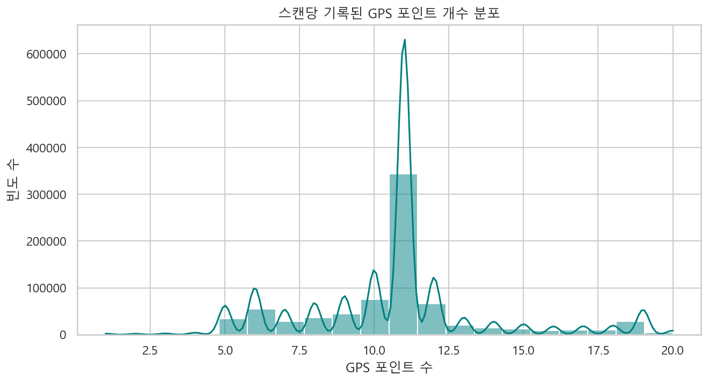
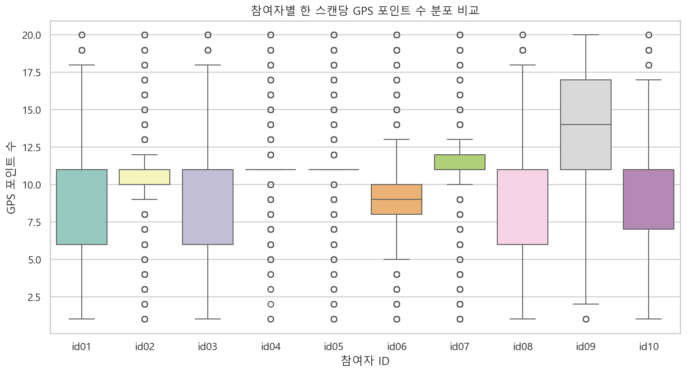
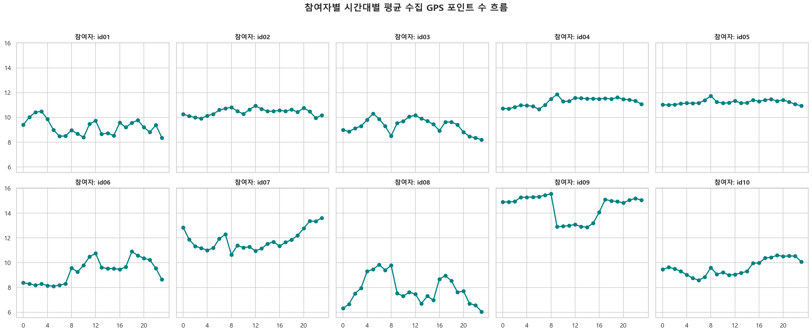
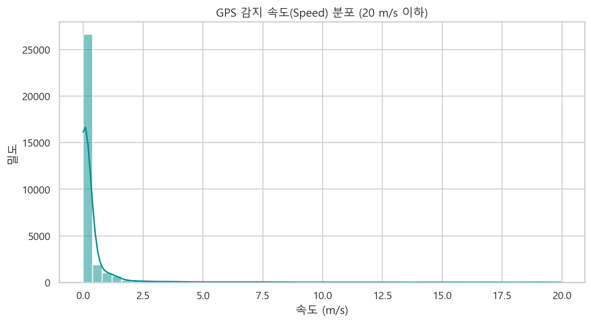
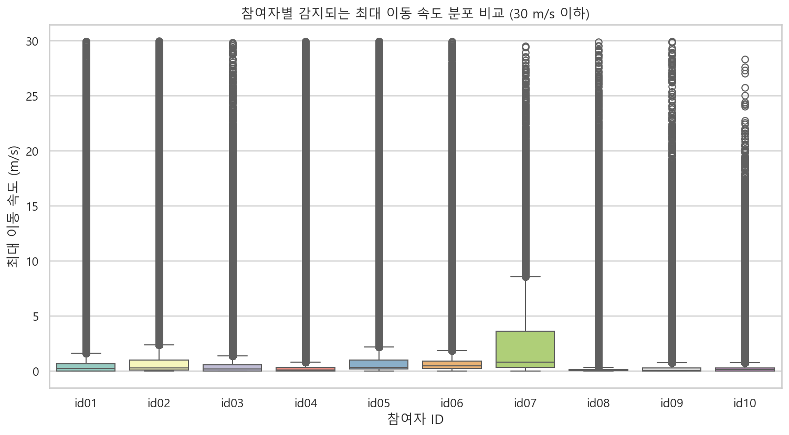
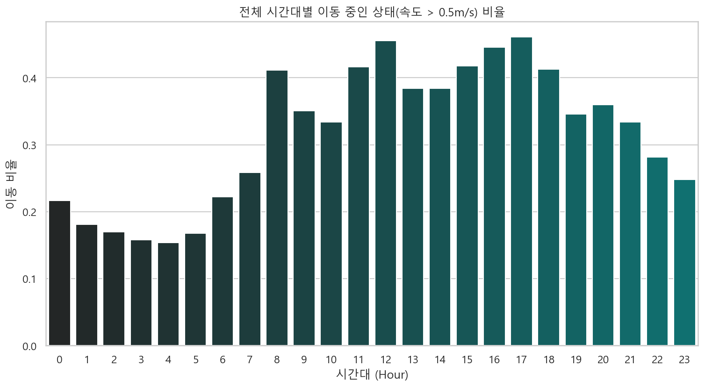
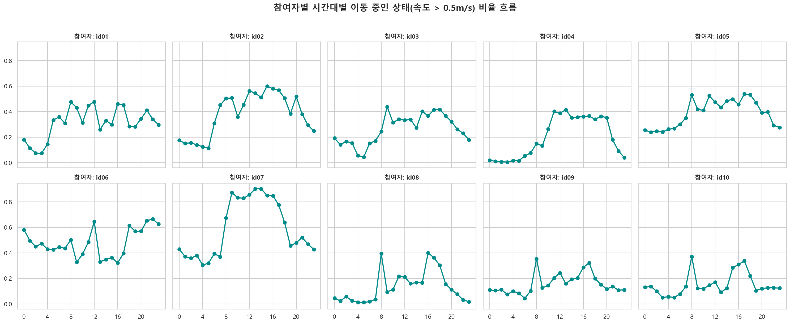

# 📍 모바일 GPS 로그 (mGps) 심층 EDA 보고서

본 보고서는 `ch2025_mGps.parquet` 모바일 GPS 수집 데이터를 분석하여, 수집된 좌표 포인트 수 분포, 이동 속도 특성, 참여자별 고유한 시공간적 활동 범위 및 시간대별 이동성 흐름을 고찰합니다. 이를 바탕으로 모델의 예측력을 높일 수 있는 전처리 및 피처 엔지니어링 전략을 제시합니다.

---

## 1. 데이터 개요 및 무결성 검증

* **데이터 형태 (Shape)**: `(800,611, 3)` (800,611 건의 스캔 시점 레코드)
* **결측치 (Null Values)**: 모든 컬럼(`subject_id`, `timestamp`, `m_gps`)에서 결측치 **0건**으로 완전무결합니다.
* **대상 참여자 (Subjects)**: 총 10명 (`id01` ~ `id10`)
* **총 GPS 포인트 관측 수**: 각 행의 `m_gps` 리스트를 평탄화(explode)한 결과, 총 **`8,546,932 건`**의 개별 위치-속도 로그 포인트가 존재합니다.

---

## 2. 수집된 GPS 데이터 포인트 개수 분석

한 번의 스캔 로그 주기(약 10분 단위) 동안 단말기에 기록된 GPS 데이터 포인트 개수의 기본적인 통계 및 분포를 파악했습니다.

* **최대 기록 포인트 수**: 20개
* **최소 기록 포인트 수**: 1개
* **평균 기록 포인트 수**: 약 10.68개
* **중앙값 (Median)**: 11.0개
* **표준편차 (Std)**: 3.11개

### 📊 스캔당 기록된 GPS 포인트 개수 분포 시각화

---

## 3. 참여자별 GPS 데이터 포인트 개수 및 일주기(Hourly) 흐름 분석

참여자 개개인의 기기 모델 또는 시스템 스케줄에 따른 수집 주기 활성화 특징을 확인합니다.

### 📊 참여자별 한 스캔당 GPS 포인트 수 분포 비교 (Boxplot)

### 📊 참여자별 시간대별 평균 수집 GPS 포인트 수 흐름 (2x5 Grid)

### 💡 주요 인사이트
* **기기 수집의 안정성**: 대부분의 참여자(`id02` ~ `id10`)는 1회 스캔 시 평균 10~11개의 GPS 포인트를 24시간 내내 안정적으로 수집하고 있습니다.
* **id01 참여자의 야간 수집 감소**: `id01` 참여자는 새벽 시간대(00:00 ~ 06:00)에 수집되는 GPS 포인트 수가 평균 6~7개 선으로 크게 감소합니다. 이는 배터리 절약 모드 진입이나 백그라운드 수집 제한 등 기기별 OS 설정의 차이로 해석될 수 있습니다.

---

## 4. 속도(Speed) 분포 탐색 및 이동 속도 비교

GPS 데이터에서 수집된 이동 속도(Speed) 정보를 통해 사용자의 동적인 활동성을 파악했습니다.
* **속도 데이터 특성**: 공식 가이드라인에 따라 m/s와 km/h 단위가 혼재되어 수집되었을 가능성이 있으므로 해석에 유의해야 합니다.

### 📊 GPS 감지 속도(Speed) 분포 (20 m/s 이하)

### 📊 참여자별 감지되는 최대 이동 속도 분포 비교 (Boxplot - 30 m/s 이하)

### 💡 주요 인사이트
* **정지 상태의 지배성**: 속도 분포 시각화 결과 대부분의 관측치가 0.1 m/s 미만에 몰려 있어, 현대인들의 일상생활 속 정지 상태(실내 체류 등)가 매우 압도적인 비율을 차지함을 알 수 있습니다.
* **참여자별 이동성 차이**: 
  - `id02`, `id06`, `id09` 참여자는 최대 속도의 75% 분위수(Q3)가 상대적으로 높게 형성되어 대중교통이나 차량을 이용한 활발한 이동 패턴이 자주 감지됩니다.
  - 반면 `id01`, `id08` 참여자는 최대 속도가 대부분 1~2 m/s 내외에 분포하여 도보 위주의 근거리 정적 생활 패턴에 머무르고 있음을 보증합니다.

---

## 5. 시간대별 이동 패턴 분석 (이동 속도가 0.5 m/s 이상인 빈도)

각 스캔 시점별 최대 속도가 `0.5 m/s` (도보 이동 속도 기준)를 초과하는 경우를 **이동 상태(is_moving = 1)**로 판별하여 일주기 흐름을 고찰했습니다.

### 📊 전체 시간대별 이동 중인 상태(속도 > 0.5m/s) 비율

### 📊 참여자별 시간대별 이동 중인 상태 비율 흐름 (2x5 Grid)

### 💡 주요 인사이트
* **출퇴근 시간대의 보편적 피크**: 전체 이동 비율 그래프를 보면 출근 시간대(08:00 ~ 09:00)와 퇴근 시간대(17:00 ~ 19:00)에 이동 비율이 20~25%까지 명확히 상승하는 쌍봉형(Bimodal) 패턴을 보입니다.
* **개인별 라이프스타일 변이**:
  - `id02`, `id06` 참여자는 전형적인 직장인/학생 패턴으로 아침과 저녁에 뚜렷한 출퇴근 피크가 발생합니다.
  - `id01` 참여자는 하루 중 이동 비율이 최대 5%를 거의 넘지 않는 극도의 정적인 은둔형 수집 형태를 보입니다.
  - `id09` 참여자는 낮 시간대뿐 아니라 밤늦은 시간(22:00 ~ 24:00)에도 15% 이상의 높은 이동 비율을 유지하여, 야간 활동(야근, 야간 취미, 야간 대중교통 등)이 포함된 동적 라이프스타일을 가지고 있음을 보여줍니다.

---

## 6. 모델 성능 향상을 위한 피처 엔지니어링 제안

1. **`gps_total_records` (기기 백그라운드 활성화 정도)**
   - 하루 동안 수집된 총 GPS 로그 포인트 개수입니다. 수집 주기가 비정상적으로 적은 날은 스마트폰 꺼짐 혹은 고립 상태를 대변할 수 있으며, 주간 스트레스 지표와의 연관성을 분석할 수 있습니다.
2. **`gps_max_speed` (차량 이용 여부 및 이동 반경 스케일)**
   - 하루 중 감지된 최대 속도값입니다. 시속 30km/h(약 8.3m/s) 이상의 속도가 존재할 경우 차량/대중교통 탑승 일수로 분류할 수 있으며, 이는 외출의 능동성 및 외출 거리를 예측하는 중요 설명 인자가 됩니다.
3. **`gps_moving_ratio` (일간 이동성 시간 비율)**
   - 하루 전체 GPS 스캔 중 `max_speed > 0.5 m/s`를 충족하는 비율입니다. 사용자의 물리적 사회 활동성 및 칼로리 소비 성향을 대변하여 삶의 만족도(Q3) 및 수면 만족도(Q1) 예측 모델에 직접적인 기여가 가능합니다.
4. **`gps_location_entropy` (위치 엔트로피)**
   - 경위도 좌표를 일정 그리드(예: 100m x 100m)로 격자화한 뒤, 방문한 격자별 빈도의 엔드로피를 계산하여 주 생활 반경의 다양성을 정량화합니다. 생활 반경이 지나치게 단조로운(엔트로피가 낮은) 경우 우울감이나 피로도 점수와 높은 상관성을 보일 수 있습니다.
